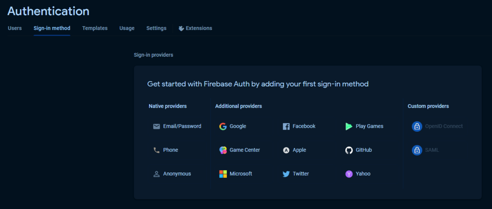
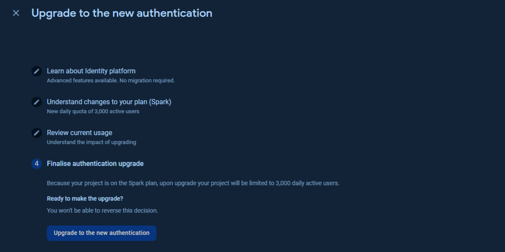
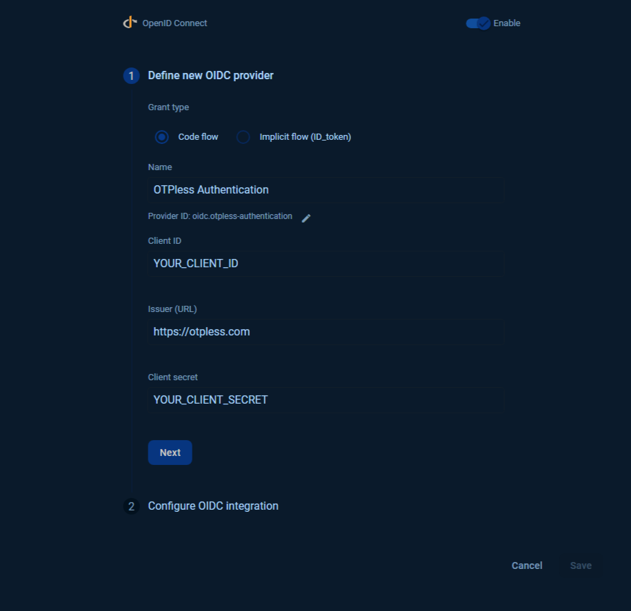
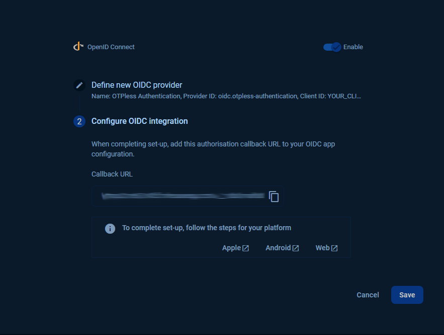
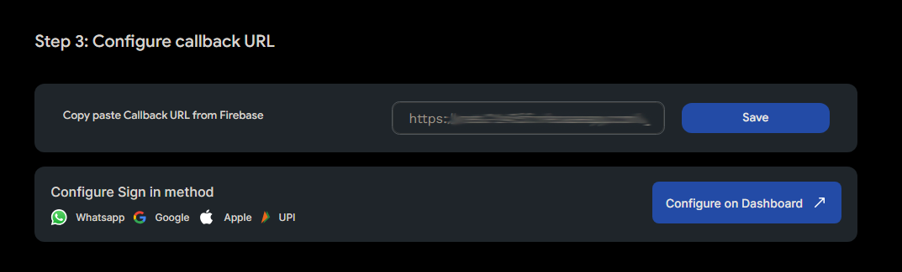

# OTPless Firebase authentication

Integrate One Tap WhatsApp Sign In into your application using Firebase OpenID Connect.

1. Go to Firebase Console[🔗](https://console.firebase.google.com/)
2. Navigate to Authentication > Sign in method

    
3. Click on **OpenID Connect**
   - Upgrade to Firebase Auth with Identity Provider
    

4. Enable *OpenID Connect* and select **Code flow**
    
    1. Add required fields from your OTPless [docs](https://otpless.com/platforms/firebase#firebase_STEP_2)
    2. Copy the `Provider Id` to use in your app.
    3. Click Next > Copy the Callback URL and Hit Save
        
5. Finally paste the Callback URL from the previous step in the **Callback URL** field in the OTPless [docs](https://otpless.com/platforms/firebase#firebase_STEP_3) and hit save.
    

> ***Follow Firebase official docs to complete the authentication setup for your app's platform.***
> - [***IOS***](https://firebase.google.com/docs/auth/ios/openid-connect)
> - [***Android***](https://firebase.google.com/docs/auth/android/openid-connect)
> - [***Web***](https://firebase.google.com/docs/auth/web/openid-connect)

## Examples

- [React JS](./firebase-react-auth/)

## Happy Authenticating!
